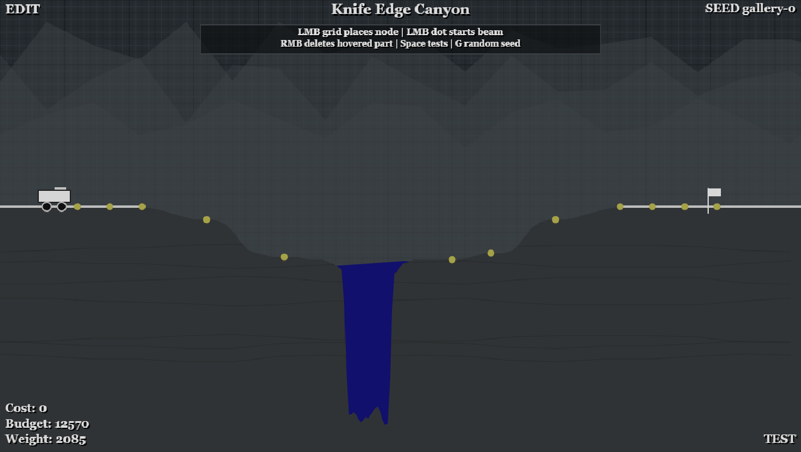
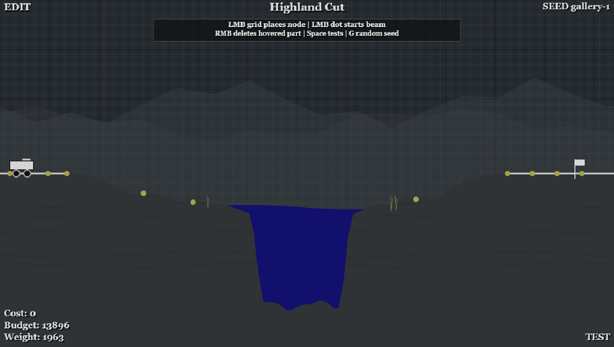
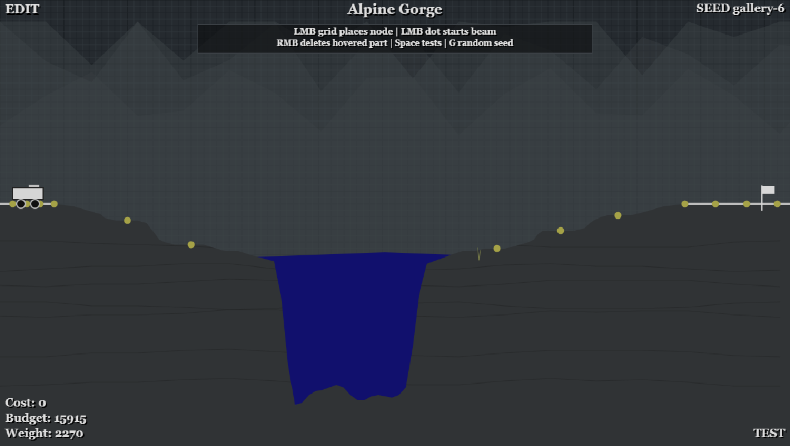
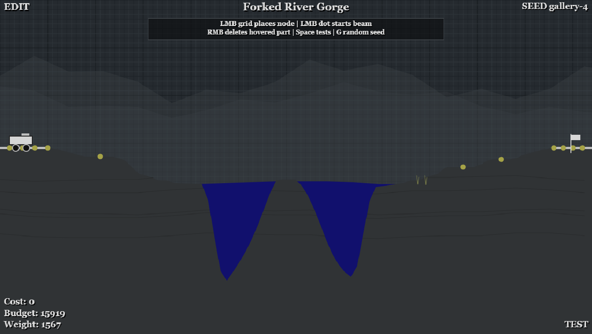
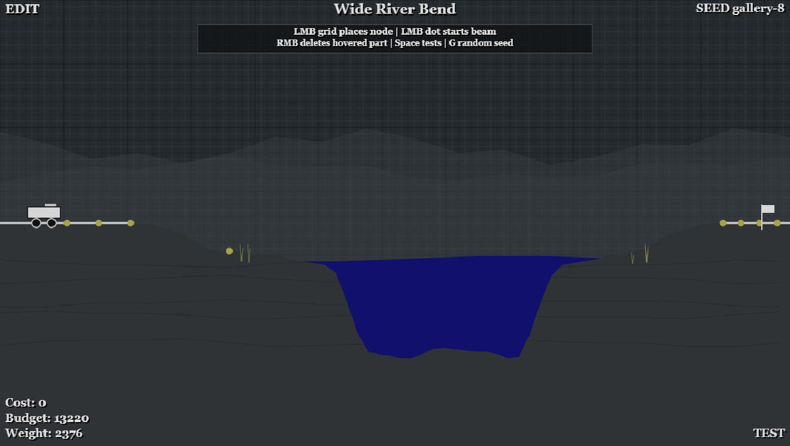
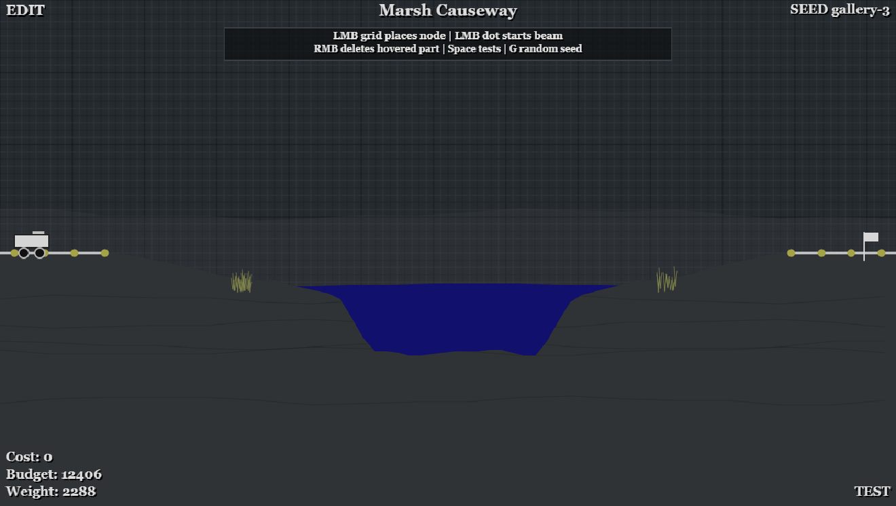
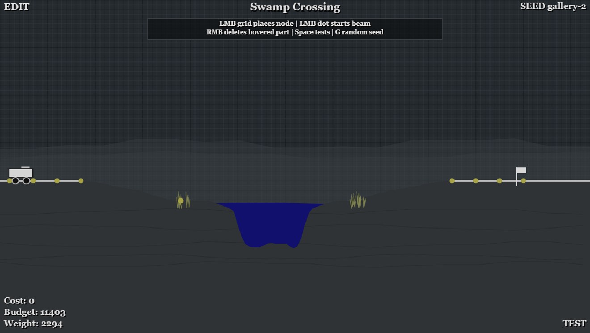

# Bridge Builder

A static browser-based bridge-building game inspired by classic Bridge Builder puzzles. The whole
game runs from GitHub Pages: root HTML, static CSS, vanilla JavaScript, and one HTML5 Canvas.

The editor, renderer, physics simulation, vehicle crossing, and procedural level generator all run
in the browser. Every level is generated from a seed, so the same seed always recreates the same
bridge problem while new seeds produce different spans, anchor shelves, water bodies, ridgelines,
and budgets.

## GitHub Pages

This repository is designed to publish directly from `main` at `/`, matching GitHub Pages'
"Deploy from a branch" root configuration.
There is no build step: GitHub Pages serves `index.html`, `.nojekyll`, `static/`, and
`screenshots/` directly from the repository.

Open the published project page:

```text
https://cafawo.github.io/bridgebuilder/
```

Seeded levels are shareable through the query string:

```text
https://cafawo.github.io/bridgebuilder/?seed=smoke-seed
```

Deployment checklist:

- Commit the root `index.html`, `.nojekyll`, `static/`, `screenshots/`, and docs.
- Push to `main`.
- Wait for the GitHub Pages publish step to finish.
- Open the project page and verify a seed URL renders the canvas.

## Procedural Biome Gallery

These screenshots are actual seeded canvas captures from the game. They show the range of visual
regimes the generator can produce while keeping the same restrained Bridge Builder style: dark grid,
rock silhouettes, water, anchor nodes, straight beams, and simple terrain.

<table>
  <tr>
    <th>Canyon</th>
    <th>Highlands</th>
    <th>Alpine Gorge</th>
  </tr>
  <tr>
    <td></td>
    <td></td>
    <td></td>
  </tr>
  <tr>
    <th>Split Valley</th>
    <th>Riverlands</th>
    <th>Marshland</th>
  </tr>
  <tr>
    <td></td>
    <td></td>
    <td></td>
  </tr>
  <tr>
    <th>Swampland</th>
    <th></th>
    <th></th>
  </tr>
  <tr>
    <td></td>
    <td></td>
    <td></td>
  </tr>
</table>

The full-page captures used to make this gallery are kept in `screenshots/procedural/`.

## Procedural Generation

The generator lives in `static/game/js/generator.js`. It runs synchronously in the browser with a
deterministic string-seeded PRNG, so each normalized seed maps to one stable level. The generated
level object is consumed directly by the editor, renderer, and physics code; there is no runtime
level API to host.

The core shape source is the Superformula:

```text
r(phi) = (
  |cos(m * phi / 4) / a|^n2
  + |sin(m * phi / 4) / b|^n3
)^(-1 / n1)
```

Each level samples two independent Superformula parameter sets:

- `shore`: controls the left and right cliff profiles descending from road height to water.
- `river`: controls the riverbed or basin floor under the water.

The generator chooses a weighted biome regime, builds shore profiles and optional cliff shelves,
clips organic water polygons inside the bridge gap, adds anchor platforms, and emits vehicle,
physics, budget, terrain, backdrop, and detail data.

Generation is intentionally small enough to stay on the main thread. The expensive work during play
is still the per-frame canvas rendering and bridge simulation, not creating a seeded level.

## Physics Simulation

The simulation lives in `static/game/js/physics.js`. It uses point masses, Verlet-style integration,
distance constraints, stress estimates, deterministic beam breakage, and a simple two-wheel vehicle.

Beams are not hard length-capped. Long beams are legal, but they cost material and become weaker
through self-weight, bending, and long-span stress. Deck beams near road height carry the vehicle;
lower or steep beams act as supports.

## Local Run

Create or update the conda environment used for local checks:

```bash
conda env create -f environment.yml
conda env update -n bridgebuilder -f environment.yml --prune
```

Serve the repository root:

```bash
conda run -n bridgebuilder python -m http.server 8000
```

Open:

```text
http://127.0.0.1:8000/?seed=smoke-seed
```

If port `8000` is busy, use another port and keep the same `?seed=...` query string.

## Controls

- Left click: select/place nodes, create beams, or split an existing beam by clicking it
- Right click: cancel active beam building; when nothing is selected, delete the nearest node or beam
- Delete/Backspace: cancel active beam building; otherwise delete the hovered node or beam
- Z or Ctrl+Z: undo the last build/delete action
- Space: toggle build/test simulation mode
- R: reset the level
- Esc: cancel active beam building; pause/unpause while testing
- G: generate and load a new random seed
- Seed field: enter a seed and press Load to recreate that map

## Tests and Lint

```bash
conda run -n bridgebuilder pytest
conda run -n bridgebuilder ruff check .
```

## Structure

```text
.
|-- .nojekyll
|-- AGENTS.md
|-- README.md
|-- environment.yml
|-- index.html
|-- pyproject.toml
|-- static/
|   `-- game/
|       |-- css/
|       |   `-- style.css
|       `-- js/
|           |-- editor.js
|           |-- generator.js
|           |-- levels.js
|           |-- main.js
|           |-- physics.js
|           |-- renderer.js
|           `-- ui.js
|-- screenshots/
|   `-- procedural/
|       `-- showcase/
`-- tests/
```
