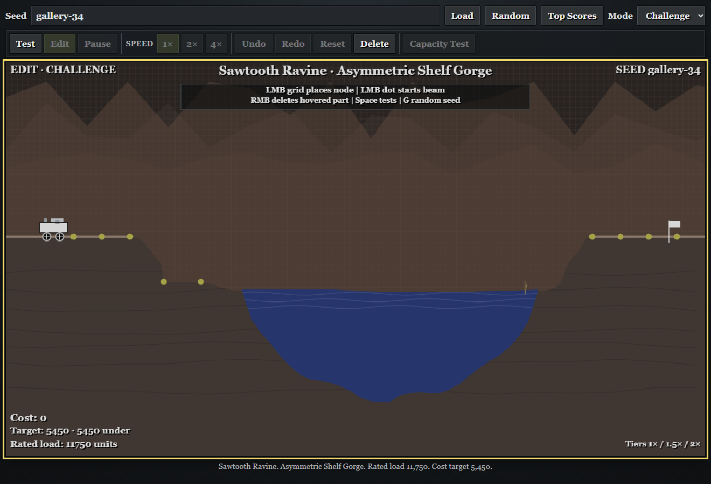
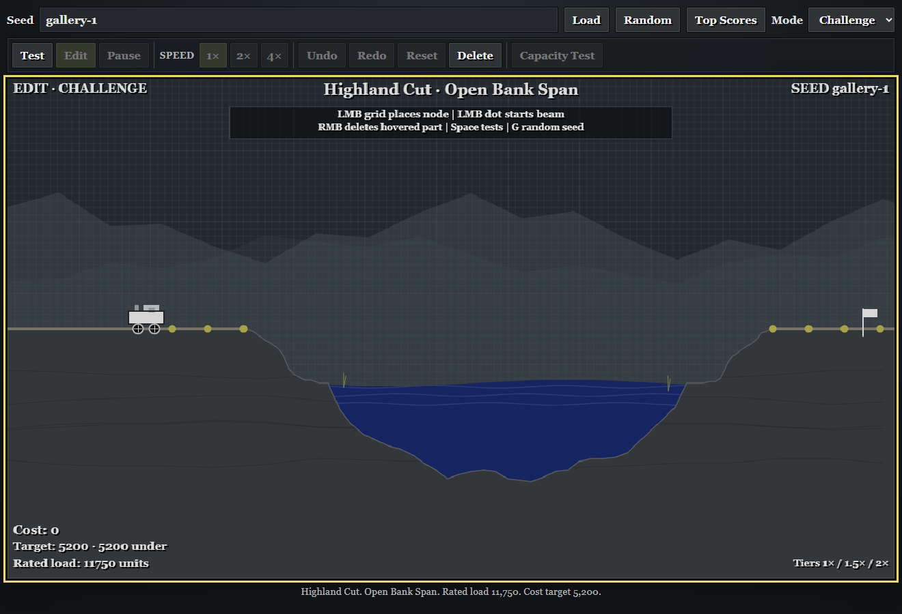
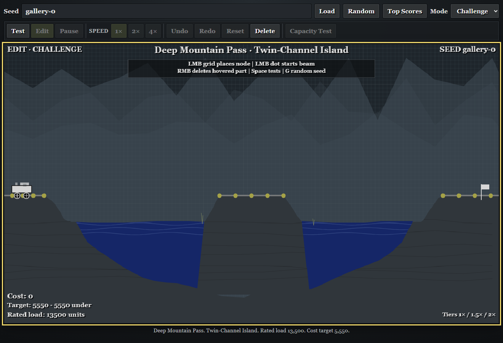
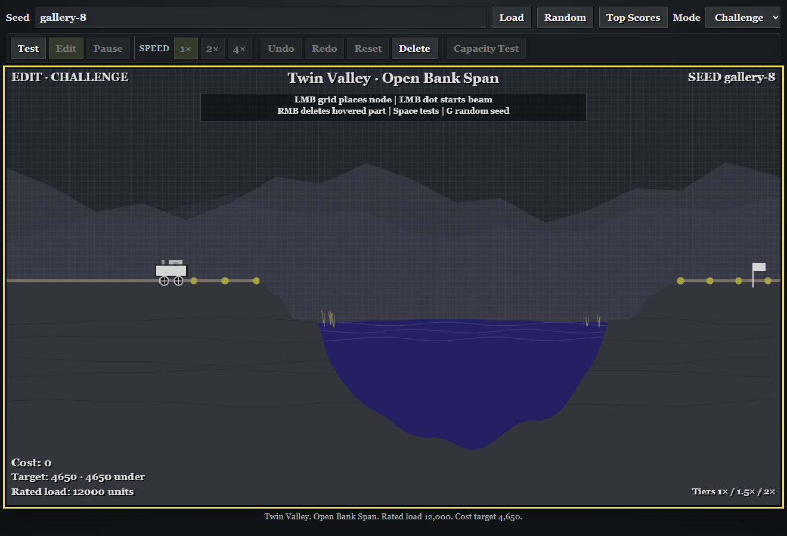
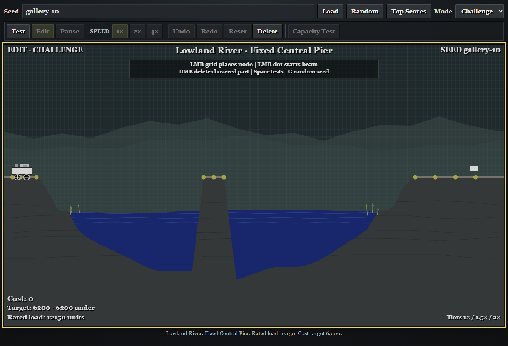
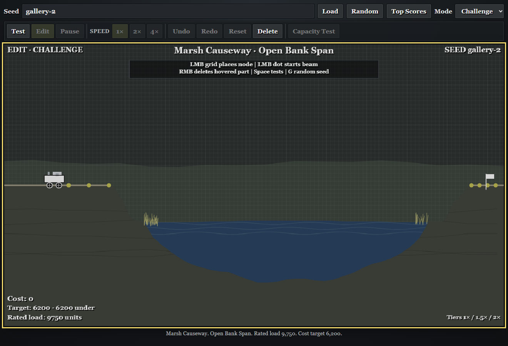
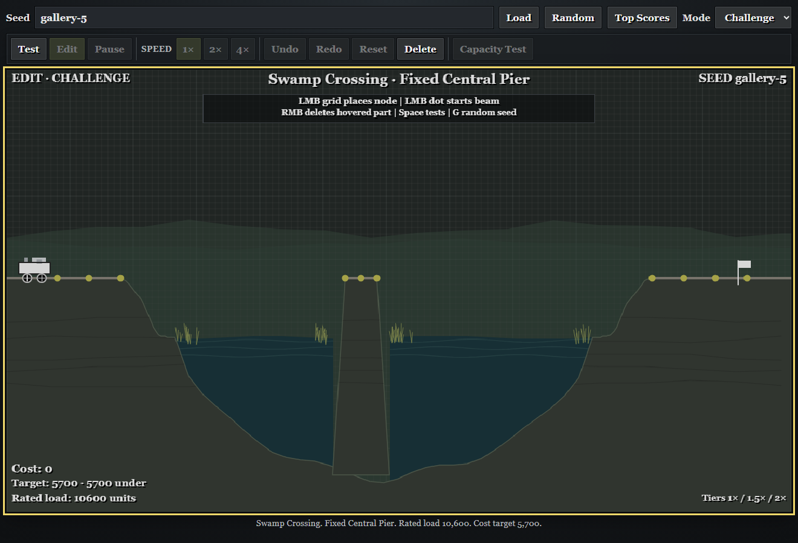

# Bridge Builder

A static browser-based bridge-building game inspired by classic Bridge Builder puzzles. The whole
game runs from GitHub Pages: root HTML, static CSS, vanilla JavaScript, and one HTML5 Canvas.

The editor, renderer, deterministic physics simulation, capacity search, persistence, and procedural
level generator all run in the browser. Challenge mode asks you to pass a seed's rated load, then
certifies the maximum load the unchanged bridge can carry. Every challenge also has an attainable
cost target, but it never blocks building or testing: certified load ranks first and lower cost
breaks ties. Sandbox mode remains available for unranked building.

## GitHub Pages

This repository is designed to publish directly from `main` at `/`, matching GitHub Pages'
"Deploy from a branch" root configuration.
There is no build step: GitHub Pages serves `index.html`, `.nojekyll`, `static/`, and
`screenshots/` directly from the repository.

Open the published project page:

```text
https://cafawo.github.io/bridgebuilder/
```

Seeded levels are shareable through the query string:

```text
https://cafawo.github.io/bridgebuilder/?seed=smoke-seed
```

The Share button adds a validated, versioned blueprint to the URL fragment. A recipient regenerates
the fixed foundations from the seed and replays the design locally; scores are never encoded in the
link.

Deployment checklist:

- Commit the root `index.html`, `.nojekyll`, `static/`, `screenshots/`, and docs.
- Push to `main`.
- Wait for the GitHub Pages publish step to finish.
- Open the project page and verify a seed URL renders the canvas.

## Analytics and Top Scores

The GoatCounter script in `index.html` records ordinary site visits for
`bridgebuilder.goatcounter.com`. A canonical page URL keeps seed and blueprint query strings from
becoming separate analytics pages. Analytics is optional: the script is asynchronous, and a blocked
or unavailable GoatCounter endpoint cannot delay game startup.

A Challenge bridge earns a global cost entry only when it carries the seed's rated load without
exceeding its cost target. The browser submits the event name below after the successful crossing:

```text
bridgebuilder-cost/v1/{generatorVersion}/{physicsVersion}/{ratedLoad}/{seed}/{cost}
```

Sandbox, failed, under-rated, capacity, and over-target tests are excluded. A versioned local
minimum prevents equal or more expensive results from being reported again.

The `Update leaderboard` GitHub Action runs daily at 02:23 UTC and can also be started manually. It
incrementally reads new GoatCounter paths, retains the lowest cost for each current-version seed,
and atomically publishes the best 100 to `static/data/leaderboard.json`. Configure it once:

1. Create a GoatCounter API token for the `bridgebuilder` site with permission to read paths.
2. Add it to the GitHub repository as the Actions secret `GOATCOUNTER_API_TOKEN`.
3. In the repository Actions settings, allow workflows to write repository contents.

The action requests a Pages rebuild after committing a changed snapshot. If GoatCounter, its API,
or the token is unavailable, the action fails before replacing the existing snapshot. The game
loads the snapshot only when Top Scores is opened and shows `Leaderboard unavailable` for any
network, timeout, schema, or version failure.

## Procedural Challenge Gallery

These are current full-page captures from Challenge mode, not concept art. Together they show all
seven cosmetic biomes and all four mechanical archetypes while keeping the renderer to one Canvas
and simple primitives. The named seeds can be loaded directly with `?seed=...`.

<table>
  <tr>
    <th>Canyon<br><code>gallery-34</code></th>
    <th>Highlands<br><code>gallery-1</code></th>
    <th>Alpine Gorge<br><code>gallery-0</code></th>
  </tr>
  <tr>
    <td></td>
    <td></td>
    <td></td>
  </tr>
  <tr>
    <th>Split Valley<br><code>gallery-8</code></th>
    <th>Riverlands<br><code>gallery-10</code></th>
    <th>Marshland<br><code>gallery-2</code></th>
  </tr>
  <tr>
    <td></td>
    <td></td>
    <td></td>
  </tr>
  <tr>
    <th>Swampland<br><code>gallery-5</code></th>
    <th></th>
    <th></th>
  </tr>
  <tr>
    <td></td>
    <td></td>
    <td></td>
  </tr>
</table>

The matching full-resolution captures are retained in `screenshots/procedural/`. The original
reference screenshots are also preserved in `screenshots/`.

## Procedural Generation

The generator lives in `static/game/js/generator.js`. It runs synchronously in the browser with a
deterministic string-seeded PRNG, so each normalized seed maps to one stable level. The generated
level object is consumed directly by the editor, renderer, and physics code; there is no runtime
level API to host.

The core shape source is the Superformula:

```text
r(phi) = (
  |cos(m * phi / 4) / a|^n2
  + |sin(m * phi / 4) / b|^n3
)^(-1 / n1)
```

Mechanical and cosmetic random streams are separate, so scenery changes cannot alter a challenge's
geometry, load, cost target, or fingerprint. Four mechanical archetypes are generated:

- open bank span
- asymmetric shelf gorge
- fixed central pier
- twin channel with a driveable island and two independent water hazards

Each site is calibrated around a hidden, constructible reference truss. Generation replays the
reference and an unsupported deck through the deterministic solver, rejecting the candidate unless
the truss passes its rated load and the bare deck fails. The advisory cost target is the reference
cost plus 25% headroom, so every accepted puzzle has a known solution below the target. Players may
continue building, test, share, and certify capacity above it; the HUD and results report the
overrun. The seven visual biomes add independent shore and riverbed shapes, palettes, animated
water, reeds, ridgelines, and small effects using Canvas primitives only. Explicit terrain, water,
hazard, and build-exclusion polygons keep rendering, editing, and collision aligned.

Generation is intentionally small enough to stay on the main thread. The expensive work during play
is still the per-frame canvas rendering and bridge simulation, not creating a seeded level.

## Physics Simulation

The simulation lives in `static/game/js/physics.js`. It uses a fixed 1/120-second tick, point masses
derived from connected member length, Verlet constraints with order-independent accumulated
corrections, normalized axial/bending utilization, and deterministic break ordering.

Axles use swept, one-sided contact and transfer the full selected train load through their actual
contacts. Airborne vehicles lose traction. Drowning, terrain impact, tipping, falling, and stalling
are evaluated before success; the rear axle must remain supported on the exit road for 30 ticks.
Collinear beam splits do not create free capacity.

After a rated-load pass, Capacity Test freezes the blueprint, brackets failure exponentially, then
binary-searches and reverifies an adjacent 50-unit pass/fail boundary. Records rank maximum certified
load first and construction cost second, and are isolated by generator, physics, seed fingerprint,
and mode versions.

## Local Run

The shipped game contains no Python runtime. Python is used only by the local test/server harness.
Create or update its conda environment:

```bash
conda env create -f environment.yml
conda env update -n bridgebuilder -f environment.yml --prune
```

Serve the repository root:

```bash
conda run -n bridgebuilder python -m http.server 8000
```

Open:

```text
http://127.0.0.1:8000/?seed=smoke-seed
```

If port `8000` is busy, use another port and keep the same `?seed=...` query string.

## Controls

- Pointer or touch: select/place nodes, create beams, or split a beam
- Right click or Escape: cancel the active beam
- Toolbar: Test/Edit, Pause, 1×/2×/4× speed, Undo/Redo, Reset, Delete, and Capacity Test
- Delete/Backspace: delete the hovered item
- Z / Shift+Z: undo / redo
- Space: test, pause, or return to editing
- R: reset the bridge; the reset itself is undoable
- G: load a new random seed
- Seed field: recreate a specific challenge

Drafts and personal bests are saved locally. Result panels provide Retry, Improve, New Seed, and
Share actions, and all controls expose keyboard focus and live status text.

## Tests and Lint

Install Chrome, Chromium, or Edge before running the browser suite. If it is not found
automatically, set `CHROME_BIN` to the browser executable.

```bash
conda run -n bridgebuilder pytest -q
conda run -n bridgebuilder ruff check --no-cache .
```

Pytest serves the static site and drives installed Chrome/Chromium in headless mode. The browser
suite executes the real JavaScript modules without Node and checks deterministic physics at
30/60/120/144 Hz, beam-order invariance, capacity boundaries, editor history and blueprint
validation, a 1,000-seed generation/constructibility corpus, and the real Challenge/Sandbox UI.

The three compatibility versions are deliberate:

- `GENERATOR_VERSION` isolates seed geometry and challenge fingerprints.
- `PHYSICS_VERSION` isolates comparable capacity records.
- `BLUEPRINT_VERSION` isolates drafts, records, and shared design payloads.

When deployed module behavior changes, keep the `?v=challenge3` browser cache tags coordinated.

## Structure

```text
.
|-- .nojekyll
|-- AGENTS.md
|-- README.md
|-- environment.yml
|-- index.html
|-- pyproject.toml
|-- .github/
|   |-- scripts/
|   |   `-- update-leaderboard.ps1
|   `-- workflows/
|       `-- update-leaderboard.yml
|-- static/
|   |-- data/
|   |   `-- leaderboard.json
|   `-- game/
|       |-- css/
|       |   `-- style.css
|       `-- js/
|           |-- editor.js
|           |-- blueprint.js
|           |-- capacity.js
|           |-- generator.js
|           |-- leaderboard.js
|           |-- levels.js
|           |-- main.js
|           |-- physics.js
|           |-- renderer.js
|           `-- ui.js
|-- screenshots/
|   |-- bridgebuilder.jpg
|   |-- bridgebuilder-screenshot.avif
|   |-- bbg2-2.gif
|   `-- procedural/
|       `-- showcase/
`-- tests/
    |-- app_runner.html
    |-- browser_runner.html
    |-- test_browser_game.py
    |-- test_leaderboard_workflow.py
    `-- test_static_site.py
```
